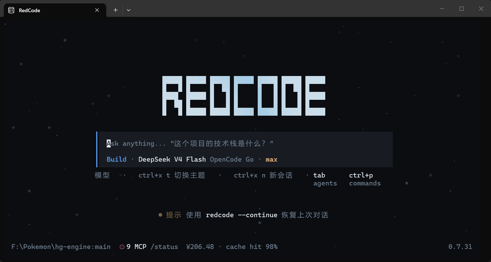

# ⚡ RedCode

<p align="center">
  
</p>

> **中文母语的 AI 编程助手。** 终端（TUI）或桌面（GUI），说中文，插你喜欢的模型——DeepSeek、OpenAI、Anthropic、Ollama，国产优先。
>
> 基于 [opencode](https://github.com/anomalyco/opencode)（sst.dev）深度二次开发，侧重**前缀缓存优化、多模型适配、中文体验和稳定性**。

[](CHANGELOG.md)
[](CHANGELOG.md)
[](https://github.com/JiaHuiRed/RedCode)
[](https://typescriptlang.org)
[](https://bun.sh)
[](LICENSE)

---

## ✨ 这是什么？

AI 编程助手。两个入口、同一引擎：

- **TUI** — 终端命令行界面（`packages/opencode`）
- **GUI** — 桌面窗口程序，Electron（`packages/desktop`；Tauri 迁移中，`src-tauri/` 工程已就位，构建流程尚未接入）

读代码、写代码、改 bug、跑命令。你说中文，它干活。

### 核心能力

代码理解（jCodeMunch / TypeGraph）· 多模型（DeepSeek / OpenAI / Anthropic / Ollama）· 文件读写编辑 · 终端执行 · Web 搜索 · 视觉分析 · 会话管理 · 权限门控与防护环 · 上下文压缩 · 自动化记忆系统 · 目标管理 · Skill 技能系统 · 四角色子代理（explore / architect / fixer / reviewer，可按角色分配不同模型）· 防重复循环检测 · 自定义 AI 人格

### 特点

- **前缀缓存保鲜**：多层缓存（msgPin → modelMsgs → tools → system）压低输入成本
- **多模型计价适配**：支持 DeepSeek cache 计价阶梯，修复上游 `cacheReadInputTokens` 为 0 的漏报
- **中文体验**：完整中文文档、中文 UI
- **国产模型优先**：零配置支持 DeepSeek、GLM、Qwen、MiniMax、Zhipu 等
- **多机同步**：机器本地覆盖层 `redcode.local.jsonc`，同步的配置只留机器无关内容

---

## 🚀 快速开始

前置要求：[Bun](https://bun.sh) 1.3+

```bash
git clone https://github.com/JiaHuiRed/RedCode.git
cd RedCode
bun install

# 启动 TUI
bun dev

# 或启动桌面 GUI
cd packages/desktop && bun run dev
```

> 第一次启动自动创建 `~/.redcode/` 并播种默认模板，无需手动配置。

### 编译

> 也可直接双击一键 bat：TUI `packages/opencode/build.bat` / GUI `packages/desktop/build-and-package.bat`。

```bash
# TUI 单文件 exe
cd packages/opencode && bun run build

# 桌面 GUI
cd packages/desktop && bun run build && bun run package
```

> TUI 编译产物：`packages/opencode/dist/redcode-windows-x64/bin/redcode.exe`，可直接双击运行——无参数启动会先显示工作区选择器，支持从已注册项目中选择，或经"Open a different directory..."手输/粘贴任意目录路径。

---

## 📖 用户手册

全部操作指南在 **[MANUAL.md](MANUAL.md)**，涵盖：

1. 快速启动 · 2. 首次设置（模型 / 称呼 / AI 人格）· 3. 配置模型（适配器 / 切换 / 本地 Ollama）
4. MCP 服务器（预配置服务的启用）· 5. AI 人格系统 · 6. 记忆系统（自动日志 / 长期库 / 启动注入）
7. 配置详解（配置层次 / 权限门控 / 自定义 MCP）· 8. 内置命令 · 9. Skill 技能系统
10. 隐私与多机同步——含**机器本地覆盖层**，解决"同一份配置在两台机器上来回改"的死循环

---

## 📋 更新日志

见 [CHANGELOG.md](CHANGELOG.md)。

---

## 💙 致谢

- 原项目：[opencode](https://github.com/anomalyco/opencode)（sst.dev）
- 代码检索能力由 [jcodemunch-mcp](https://github.com/jgravelle/jcodemunch-mcp) 提供驱动
- 许可证：MIT
